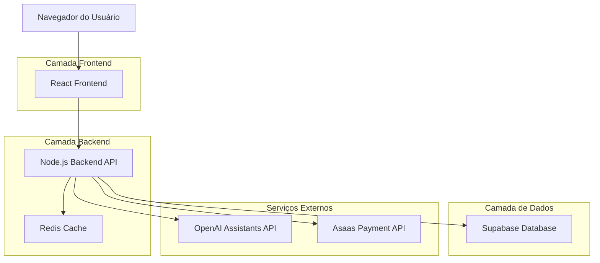
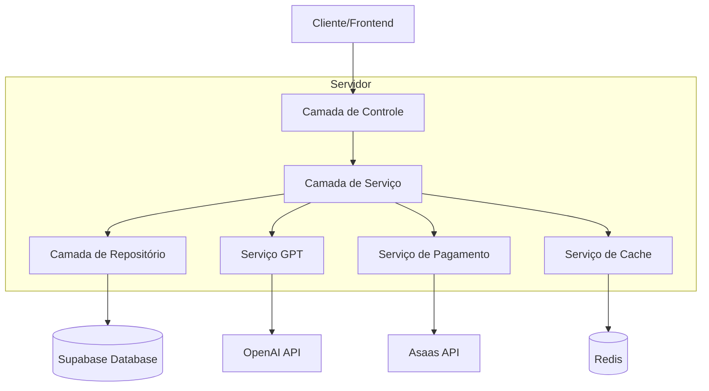
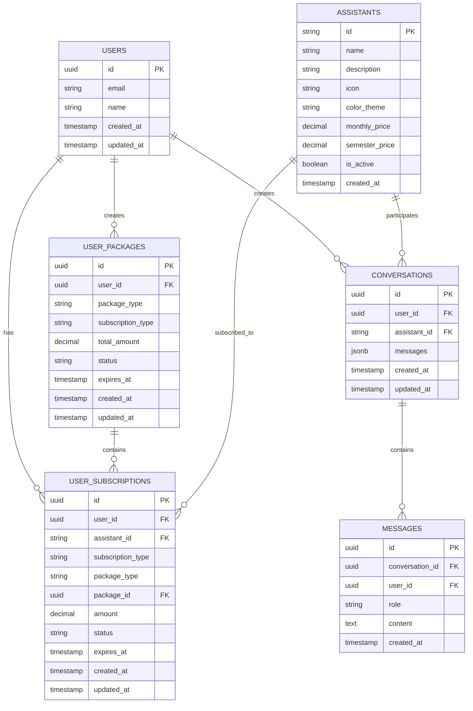

# Arquitetura Técnica - NeuroIA Lab

## 1. Arquitetura do Sistema



## 2. Descrição das Tecnologias

- **Frontend**: React@18 + TypeScript + Tailwind CSS@3 + Vite + React Router
- **Backend**: Node.js + Express@4 + TypeScript + Cors + Helmet
- **Banco de Dados**: Supabase (PostgreSQL) + Supabase Auth
- **Cache**: Redis para sessões e cache de respostas
- **APIs Externas**: OpenAI Assistants API, Asaas Payment Gateway
- **Infraestrutura**: VPS Linux (Ubuntu) + PM2 + Nginx

## 3. Definição de Rotas Frontend

| Rota | Propósito |
|------|----------|
| / | Página inicial com redirecionamento para /auth ou /dashboard |
| /auth | Página de autenticação, permite login e cadastro de usuários |
| /dashboard | Dashboard principal, exibe apenas assistentes assinados pelo usuário |
| /store | Loja de assistentes, catálogo completo dos 14 assistentes disponíveis |
| /chat/:assistantId | Interface de chat individual para cada assistente especializado |
| /subscriptions | Gestão de assinaturas ativas, renovação e cancelamento |
| /profile | Perfil do usuário e configurações da conta |
| /admin | Painel administrativo para gestão de usuários, assistentes e sistema |
| /payments | Checkout individual por assistente e confirmação de pagamentos |
| /admin/users | Gestão de usuários |
| /admin/assistants | Gestão de assistentes |
| /admin/reports | Relatórios e métricas |

## 4. Definições de API Backend

### 4.1 APIs de Autenticação

**Login de usuário**
```
POST /api/auth/login
```

Request:
| Parâmetro | Tipo | Obrigatório | Descrição |
|-----------|------|-------------|----------|
| email | string | true | Email do usuário |
| password | string | true | Senha do usuário |

Response:
| Parâmetro | Tipo | Descrição |
|-----------|------|----------|
| success | boolean | Status da operação |
| user | object | Dados do usuário |
| token | string | JWT token de acesso |

Exemplo:
```json
{
  "email": "usuario@email.com",
  "password": "senha123"
}
```

**Verificar status do usuário**
```
GET /api/auth/me
```

Headers:
| Parâmetro | Tipo | Obrigatório | Descrição |
|-----------|------|-------------|----------|
| Authorization | string | true | Bearer token |

Response:
| Parâmetro | Tipo | Descrição |
|-----------|------|----------|
| user | object | Dados completos do usuário |
| subscription | object | Status da assinatura |

### 4.2 APIs de Assistentes

**Listar assistentes disponíveis**
```
GET /api/assistants
```

Response:
| Parâmetro | Tipo | Descrição |
|-----------|------|-----------|
| assistants | array | Lista de assistentes disponíveis para o usuário |

**Enviar mensagem para assistente**
```
POST /api/chat/:assistantId/message
```

Request:
| Parâmetro | Tipo | Obrigatório | Descrição |
|-----------|------|-------------|----------|
| message | string | true | Mensagem do usuário |
| conversationId | string | false | ID da conversa (para continuidade) |

Response:
| Parâmetro | Tipo | Descrição |
|-----------|------|----------|
| response | string | Resposta do assistente |
| conversationId | string | ID da conversa |
| messageId | string | ID da mensagem |

### 4.3 APIs de Pagamento

**Criar assinatura individual**
```
POST /api/subscriptions/create
```

Request:
| Param Name | Param Type | isRequired | Description |
|------------|------------|------------|-------------|
| user_id | string | true | ID do usuário |
| assistant_id | string | true | ID do assistente a ser assinado |
| subscription_type | string | true | Tipo da assinatura (monthly/semester) |
| payment_method | string | true | Método de pagamento |

Response:
| Param Name | Param Type | Description |
|------------|------------|-------------|
| subscription_id | string | ID da assinatura criada |
| assistant_id | string | ID do assistente assinado |
| status | string | Status da assinatura |
| expires_at | string | Data de expiração |
| amount | number | Valor pago |

**Criar pacote personalizado**
```
POST /api/packages/create
```

Request:
| Param Name | Param Type | isRequired | Description |
|------------|------------|------------|-------------|
| user_id | string | true | ID do usuário |
| package_type | string | true | Tipo do pacote (package_3/package_6) |
| assistant_ids | array | true | Array com IDs dos assistentes selecionados |
| subscription_type | string | true | Tipo da assinatura (monthly/semester) |
| payment_method | string | true | Método de pagamento |

Response:
| Param Name | Param Type | Description |
|------------|------------|-------------|
| package_id | string | ID do pacote criado |
| assistant_ids | array | IDs dos assistentes incluídos |
| total_amount | number | Valor total do pacote |
| status | string | Status do pacote |
| expires_at | string | Data de expiração |

**Validar seleção de pacote**
```
POST /api/packages/validate
```

Request:
| Param Name | Param Type | isRequired | Description |
|------------|------------|------------|-------------|
| package_type | string | true | Tipo do pacote (package_3/package_6) |
| assistant_ids | array | true | Array com IDs dos assistentes selecionados |

Response:
| Param Name | Param Type | Description |
|------------|------------|-------------|
| valid | boolean | Se a seleção é válida |
| expected_count | number | Quantidade esperada de assistentes |
| selected_count | number | Quantidade selecionada |
| total_amount | number | Valor total calculado |

**Verificar assinaturas do usuário**
```
GET /api/subscriptions/user/:userId
```

Response:
| Param Name | Param Type | Description |
|------------|------------|-------------|
| subscriptions | array | Lista de assinaturas ativas do usuário |
| total_assistants | number | Número total de assistentes assinados |

Subscription Object:
| Param Name | Param Type | Description |
|------------|------------|-------------|
| subscription_id | string | ID da assinatura |
| assistant_id | string | ID do assistente |
| assistant_name | string | Nome do assistente |
| status | string | Status da assinatura |
| subscription_type | string | Tipo (monthly/semester) |
| expires_at | string | Data de expiração |
| amount | number | Valor da assinatura |

**Webhook do Asaas**
```
POST /api/webhooks/asaas
```

Request:
| Parâmetro | Tipo | Obrigatório | Descrição |
|-----------|------|-------------|----------|
| event | string | true | Tipo do evento |
| payment | object | true | Dados do pagamento |

### 4.4 APIs Administrativas

**Listar usuários**
```
GET /api/admin/users
```

**Criar/Editar assistente**
```
POST /api/admin/assistants
PUT /api/admin/assistants/:id
```

**Relatórios de uso**
```
GET /api/admin/reports/usage
```

## 5. Arquitetura do Servidor



## 6. Modelo de Dados

### 6.1 Diagrama do Modelo de Dados



### 6.2 Data Definition Language

**Tabela de Usuários**
```sql
CREATE TABLE users (
    id UUID PRIMARY KEY DEFAULT gen_random_uuid(),
    email VARCHAR(255) UNIQUE NOT NULL,
    name VARCHAR(100) NOT NULL,
    created_at TIMESTAMP WITH TIME ZONE DEFAULT NOW(),
    updated_at TIMESTAMP WITH TIME ZONE DEFAULT NOW()
);

CREATE INDEX idx_users_email ON users(email);
```

**Tabela de Assistentes**
```sql
CREATE TABLE assistants (
    id VARCHAR(50) PRIMARY KEY,
    name VARCHAR(100) NOT NULL,
    description TEXT,
    icon VARCHAR(10),
    color_theme VARCHAR(20),
    monthly_price DECIMAL(10,2) DEFAULT 39.90,
    semester_price DECIMAL(10,2) DEFAULT 199.00,
    is_active BOOLEAN DEFAULT true,
    created_at TIMESTAMP WITH TIME ZONE DEFAULT NOW()
);

-- Inserir os 14 assistentes de psicologia
INSERT INTO assistants (id, name, description, icon, color_theme, monthly_price, semester_price) VALUES
('asst_8kNKRg68rR8zguhYzdlMEvQc', 'PsicoPlano', 'Formulador de Roteiro Terapêutico Exclusivo', '📋', '#0E1E03', 39.90, 199.00),
('asst_Ohn9w46OmgwLJhxw08jSbM2f', 'NeuroCase', 'Revisor de Quadro Clínico', '🔍', '#1A3A0F', 39.90, 199.00),
('asst_hH374jNSOTSqrsbC9Aq5MKo3', 'Guia Ético', 'Avaliação Profissional e Autorreflexão', '⚖️', '#7C3AED', 39.90, 199.00),
('asst_jlRLzTb4OrBKYWLtjscO3vJN', 'SessãoMap', 'Formulador de Estrutura de Sessão', '🗺️', '#DC2626', 39.90, 199.00),
('asst_ZuPRuYG9eqxmb6tIIcBNSSWd', 'ClinReplay', 'Treinador de Sessão (IA paciente)', '🎭', '#EA580C', 39.90, 199.00),
('asst_WdzCxpQ3s04GqyDKfUsmxWRg', 'CognitiMap', 'Construtor de Caminhos de Reestruturação Cognitiva', '🧠', '#0891B2', 39.90, 199.00),
('asst_Gto0pHqdCHdM7iBtdB9XUvkU', 'MindRoute', 'Orientador de Abordagens Psicológicas', '🧭', '#2D5A1F', 39.90, 199.00),
('asst_9RGTNpAvpwBtNps5krM051km', 'TheraTrack', 'Avaliador de Evolução Terapêutica', '📈', '#0E1E03', 39.90, 199.00),
('asst_FHXh63UfotWmtzfwdAORvH1s', 'NeuroLaudo', 'Elaborador de Laudo Psicológico', '📄', '#6366F1', 39.90, 199.00),
('asst_ZtY1hAFirpsA3vRdCuuOEebf', 'PsicoTest', 'Consultor de Testes Psicológicos', '🧪', '#EC4899', 39.90, 199.00),
('asst_bdfbravG0rjZfp40SFue89ge', 'TheraFocus', 'Organizador de Intervenções para Transtornos Específicos', '🎯', '#F59E0B', 39.90, 199.00),
('asst_nqL5L0hIfOMe2wNQn9wambGr', 'PsicoBase', 'Formulador de Estratégias Clínicas Baseadas em Evidências', '📚', '#8B5CF6', 39.90, 199.00),
('asst_62QzPGQdr9KJMqqJIRVI787r', 'MindHome', 'Elaborador de Atividades Domiciliares Terapêuticas', '🏠', '#1A3A0F', 39.90, 199.00),
('asst_NoCnwSoviZBasOxgbac9USkg', 'ClinPrice', 'Avaliador de Custos de Sessões Clínicas', '💰', '#EF4444', 39.90, 199.00);
```

**Tabela de Assinaturas por Assistente (user_subscriptions)**
```sql
CREATE TABLE public.user_subscriptions (
    id UUID PRIMARY KEY DEFAULT gen_random_uuid(),
    user_id UUID NOT NULL REFERENCES auth.users(id) ON DELETE CASCADE,
    assistant_id VARCHAR(50) NOT NULL REFERENCES public.assistants(id) ON DELETE CASCADE,
    subscription_type VARCHAR(20) NOT NULL CHECK (subscription_type IN ('monthly', 'semester')),
    package_type VARCHAR(20) CHECK (package_type IN ('individual', 'package_3', 'package_6')),
    package_id UUID REFERENCES public.user_packages(id) ON DELETE CASCADE,
    amount DECIMAL(10,2) NOT NULL,
    status VARCHAR(20) DEFAULT 'pending' CHECK (status IN ('pending', 'active', 'cancelled', 'expired')),
    asaas_subscription_id VARCHAR(100),
    expires_at TIMESTAMP WITH TIME ZONE NOT NULL,
    created_at TIMESTAMP WITH TIME ZONE DEFAULT NOW(),
    updated_at TIMESTAMP WITH TIME ZONE DEFAULT NOW(),
    UNIQUE(user_id, assistant_id)
);

-- Índices
CREATE INDEX idx_user_subscriptions_user_id ON public.user_subscriptions(user_id);
CREATE INDEX idx_user_subscriptions_assistant_id ON public.user_subscriptions(assistant_id);
CREATE INDEX idx_user_subscriptions_status ON public.user_subscriptions(status);
CREATE INDEX idx_user_subscriptions_expires_at ON public.user_subscriptions(expires_at);

-- RLS
ALTER TABLE public.user_subscriptions ENABLE ROW LEVEL SECURITY;

CREATE POLICY "Users can view own subscriptions" ON public.user_subscriptions
    FOR SELECT USING (auth.uid() = user_id);

-- Permissões
GRANT SELECT ON public.user_subscriptions TO authenticated;
GRANT INSERT, UPDATE ON public.user_subscriptions TO service_role;
```

**Tabela de Pacotes Personalizados (user_packages)**
```sql
CREATE TABLE public.user_packages (
    id UUID PRIMARY KEY DEFAULT gen_random_uuid(),
    user_id UUID NOT NULL REFERENCES auth.users(id) ON DELETE CASCADE,
    package_type VARCHAR(20) NOT NULL CHECK (package_type IN ('package_3', 'package_6')),
    subscription_type VARCHAR(20) NOT NULL CHECK (subscription_type IN ('monthly', 'semester')),
    total_amount DECIMAL(10,2) NOT NULL,
    status VARCHAR(20) DEFAULT 'pending' CHECK (status IN ('pending', 'active', 'cancelled', 'expired')),
    asaas_subscription_id VARCHAR(100),
    expires_at TIMESTAMP WITH TIME ZONE NOT NULL,
    created_at TIMESTAMP WITH TIME ZONE DEFAULT NOW(),
    updated_at TIMESTAMP WITH TIME ZONE DEFAULT NOW()
);

-- Índices
CREATE INDEX idx_user_packages_user_id ON public.user_packages(user_id);
CREATE INDEX idx_user_packages_status ON public.user_packages(status);
CREATE INDEX idx_user_packages_expires_at ON public.user_packages(expires_at);

-- RLS
ALTER TABLE public.user_packages ENABLE ROW LEVEL SECURITY;

CREATE POLICY "Users can view own packages" ON public.user_packages
    FOR SELECT USING (auth.uid() = user_id);

-- Permissões
GRANT SELECT ON public.user_packages TO authenticated;
GRANT INSERT, UPDATE ON public.user_packages TO service_role;
```

**Tabela de Robôs (robots)**
```sql
CREATE TABLE public.robots (
    id UUID PRIMARY KEY DEFAULT gen_random_uuid(),
    name VARCHAR(100) NOT NULL,
    description TEXT,
    avatar_url TEXT,
    system_prompt TEXT NOT NULL,
    gpt_model VARCHAR(50) DEFAULT 'gpt-4',
    is_active BOOLEAN DEFAULT TRUE,
    created_at TIMESTAMP WITH TIME ZONE DEFAULT NOW(),
    updated_at TIMESTAMP WITH TIME ZONE DEFAULT NOW()
);

-- Dados iniciais dos 14 robôs
INSERT INTO public.robots (name, description, system_prompt) VALUES
('Assistente Jurídico', 'Especialista em direito e legislação', 'Você é um assistente jurídico especializado...'),
('Consultor de Marketing', 'Expert em estratégias de marketing digital', 'Você é um consultor de marketing com vasta experiência...'),
('Analista Financeiro', 'Especialista em finanças e investimentos', 'Você é um analista financeiro experiente...'),
('Coach de Carreira', 'Orientador profissional e de carreira', 'Você é um coach de carreira certificado...'),
('Especialista em RH', 'Consultor em recursos humanos', 'Você é um especialista em recursos humanos...'),
('Desenvolvedor Senior', 'Expert em programação e tecnologia', 'Você é um desenvolvedor senior com ampla experiência...'),
('Designer UX/UI', 'Especialista em design de experiência', 'Você é um designer UX/UI experiente...'),
('Consultor de Vendas', 'Expert em técnicas de vendas', 'Você é um consultor de vendas com histórico comprovado...'),
('Analista de Dados', 'Especialista em análise e ciência de dados', 'Você é um analista de dados experiente...'),
('Consultor de SEO', 'Expert em otimização para mecanismos de busca', 'Você é um consultor de SEO especializado...'),
('Psicólogo Organizacional', 'Especialista em psicologia no trabalho', 'Você é um psicólogo organizacional...'),
('Contador', 'Expert em contabilidade e impostos', 'Você é um contador experiente...'),
('Arquiteto de Software', 'Especialista em arquitetura de sistemas', 'Você é um arquiteto de software senior...'),
('Consultor de Negócios', 'Expert em estratégia empresarial', 'Você é um consultor de negócios experiente...');

-- Permissões
GRANT SELECT ON public.robots TO anon;
GRANT ALL PRIVILEGES ON public.robots TO authenticated;
```

**Tabela de Relacionamento Robôs-Planos (robot_plans)**
```sql
CREATE TABLE public.robot_plans (
    robot_id UUID NOT NULL REFERENCES public.robots(id) ON DELETE CASCADE,
    plan_id UUID NOT NULL REFERENCES public.plans(id) ON DELETE CASCADE,
    PRIMARY KEY (robot_id, plan_id)
);

-- Configurar quais robôs pertencem a cada plano
-- Plano Básico: primeiros 5 robôs
INSERT INTO public.robot_plans (robot_id, plan_id)
SELECT r.id, p.id 
FROM public.robots r, public.plans p 
WHERE p.name = 'Básico' 
AND r.name IN ('Assistente Jurídico', 'Consultor de Marketing', 'Analista Financeiro', 'Coach de Carreira', 'Especialista em RH');

-- Plano Premium: todos os robôs
INSERT INTO public.robot_plans (robot_id, plan_id)
SELECT r.id, p.id 
FROM public.robots r, public.plans p 
WHERE p.name = 'Premium';

-- Permissões
GRANT SELECT ON public.robot_plans TO anon;
GRANT ALL PRIVILEGES ON public.robot_plans TO authenticated;
```

**Tabela de Conversas (conversations)**
```sql
CREATE TABLE public.conversations (
    id UUID PRIMARY KEY DEFAULT gen_random_uuid(),
    user_id UUID NOT NULL REFERENCES auth.users(id) ON DELETE CASCADE,
    robot_id UUID NOT NULL REFERENCES public.robots(id),
    title VARCHAR(200),
    created_at TIMESTAMP WITH TIME ZONE DEFAULT NOW(),
    updated_at TIMESTAMP WITH TIME ZONE DEFAULT NOW()
);

-- Índices
CREATE INDEX idx_conversations_user_id ON public.conversations(user_id);
CREATE INDEX idx_conversations_robot_id ON public.conversations(robot_id);
CREATE INDEX idx_conversations_created_at ON public.conversations(created_at DESC);

-- RLS
ALTER TABLE public.conversations ENABLE ROW LEVEL SECURITY;

CREATE POLICY "Users can manage own conversations" ON public.conversations
    FOR ALL USING (auth.uid() = user_id);

-- Permissões
GRANT ALL PRIVILEGES ON public.conversations TO authenticated;
```

**Tabela de Mensagens (messages)**
```sql
CREATE TABLE public.messages (
    id UUID PRIMARY KEY DEFAULT gen_random_uuid(),
    conversation_id UUID NOT NULL REFERENCES public.conversations(id) ON DELETE CASCADE,
    role VARCHAR(20) NOT NULL CHECK (role IN ('user', 'assistant')),
    content TEXT NOT NULL,
    created_at TIMESTAMP WITH TIME ZONE DEFAULT NOW()
);

-- Índices
CREATE INDEX idx_messages_conversation_id ON public.messages(conversation_id);
CREATE INDEX idx_messages_created_at ON public.messages(created_at DESC);

-- RLS
ALTER TABLE public.messages ENABLE ROW LEVEL SECURITY;

CREATE POLICY "Users can view messages from own conversations" ON public.messages
    FOR SELECT USING (
        conversation_id IN (
            SELECT id FROM public.conversations WHERE user_id = auth.uid()
        )
    );

CREATE POLICY "Users can insert messages in own conversations" ON public.messages
    FOR INSERT WITH CHECK (
        conversation_id IN (
            SELECT id FROM public.conversations WHERE user_id = auth.uid()
        )
    );

-- Permissões
GRANT ALL PRIVILEGES ON public.messages TO authenticated;
```