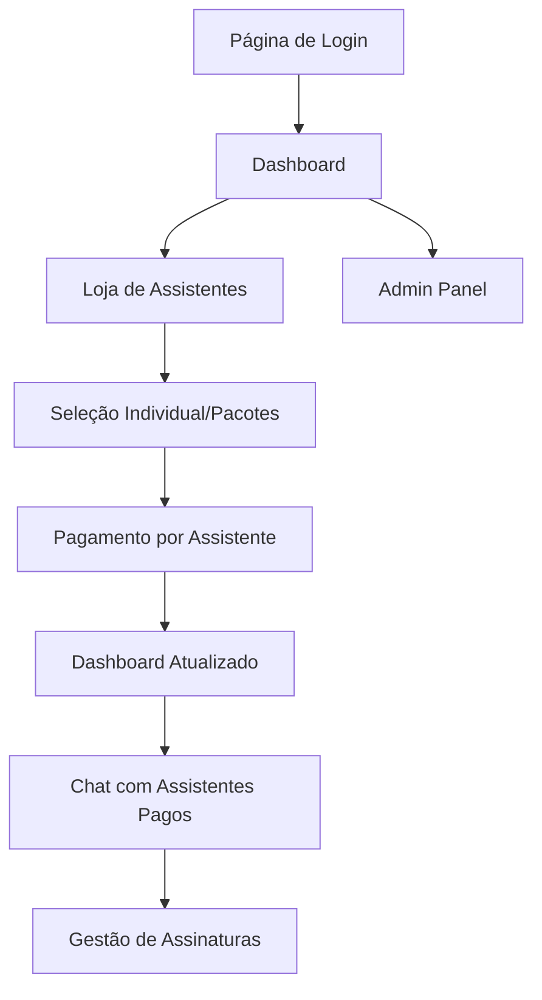

# PRD - NeuroIA Lab

## 1. Visão Geral do Produto

A **NeuroIA Lab** é uma plataforma web SaaS especializada em psicologia que oferece acesso a 14 assistentes de inteligência artificial especializados em diferentes áreas da prática psicológica através de uma interface de chat profissional. A plataforma opera com modelo de assinatura, oferecendo diferentes planos de acesso aos assistentes baseados em pagamentos processados via Asaas.

- **Problema a resolver**: Democratizar o acesso a assistentes de IA especializados em psicologia para apoiar profissionais da área em suas práticas clínicas e administrativas.
- **Público-alvo**: Psicólogos, estudantes de psicologia, clínicas e profissionais da saúde mental.
- **Valor de mercado**: Plataforma SaaS com modelo de receita recorrente baseado em assinaturas mensais/anuais focada no nicho de psicologia.

## 2. Funcionalidades Principais

### 2.1 Perfis de Usuário

| Perfil | Método de Registro | Permissões Principais |
|--------|-------------------|----------------------|
| Usuário Registrado | Email + Supabase Auth | Acesso aos assistentes que assinou individualmente |
| Administrador | Convite interno | Gerenciamento completo de usuários, assistentes e sistema |

### 2.2 Módulos de Funcionalidade

Nossa plataforma NeuroIA Lab consiste nas seguintes páginas principais:

1. **Página de Autenticação**: formulário de login/cadastro, integração Supabase Auth, recuperação de senha.
2. **Dashboard Principal**: grid de cards dos assistentes de psicologia, exibição apenas dos assistentes assinados, navegação principal.
3. **Interface de Chat**: chat individual por assistente, histórico de conversas, interface profissional focada em psicologia.
4. **Painel Administrativo**: gestão de usuários, CRUD de assistentes, relatórios de uso, configurações de sistema.
5. **Loja de Assistentes**: catálogo completo dos 14 assistentes, assinatura individual, pacotes personalizáveis, integração Asaas.
6. **Seleção de Pacotes**: interface para escolher assistentes específicos em pacotes de 3 ou 6, validação de quantidade.
7. **Página de Pagamentos**: checkout individual ou por pacote, confirmação de pagamento, gestão de assinaturas.

### 2.3 Detalhes das Páginas

| Nome da Página | Nome do Módulo | Descrição da Funcionalidade |
|----------------|----------------|-----------------------------|
| Autenticação | Formulário de Login | Autenticar usuário via Supabase Auth, validação de email/senha, redirecionamento pós-login |
| Autenticação | Formulário de Cadastro | Registrar novo usuário, validação de dados, envio de email de confirmação |
| Autenticação | Recuperação de Senha | Enviar email de reset, validar token, atualizar senha |
| Dashboard | Grid de Assistentes | Exibir cards apenas dos assistentes assinados pelo usuário, navegação para chat |
| Dashboard | Indicador de Assinaturas | Mostrar assistentes ativos, datas de vencimento, botão para assinar novos assistentes |
| Dashboard | Menu de Navegação | Links para chat, configurações, logout, admin (se aplicável) |
| Chat | Interface de Conversa | Enviar/receber mensagens, integração com assistentes especializados, histórico em tempo real |
| Chat | Histórico de Mensagens | Carregar conversas anteriores, busca no histórico, exportar conversas |
| Chat | Seletor de Assistente | Trocar entre assistentes disponíveis, informações do assistente ativo |
| Admin | Gestão de Usuários | Listar, editar, suspender usuários, visualizar planos ativos |
| Admin | Gestão de Assistentes | CRUD completo de assistentes, configurar prompts, ativar/desativar |
| Admin | Relatórios | Métricas de uso, receita, usuários ativos, logs do sistema |
| Loja | Catálogo de Assistentes | Exibir todos os 14 assistentes disponíveis, preços individuais, descrições detalhadas |
| Loja | Pacotes Personalizáveis | Oferecer pacotes de 3 e 6 assistentes com seleção customizada |
| Seleção | Interface de Escolha | Permitir seleção de exatamente 3 ou 6 assistentes específicos para pacotes |
| Seleção | Validação de Quantidade | Verificar se usuário selecionou quantidade correta antes de prosseguir |
| Seleção | Preview do Pacote | Mostrar assistentes selecionados e valor total antes do checkout |
| Pagamentos | Checkout Individual | Processar pagamento por assistente (mensal R$ 39,90 / semestral R$ 199,00) |
| Pagamentos | Checkout de Pacotes | Processar pagamento de pacotes personalizados com desconto |
| Pagamentos | Gestão de Assinaturas | Visualizar assinaturas ativas, renovar, cancelar, webhook de confirmação |

## 3. Fluxo Principal de Processos

### Fluxo do Usuário Regular:
1. **Registro/Login** → Autenticação via Supabase Auth
2. **Loja de Assistentes** → Navegar catálogo completo dos 14 assistentes
3. **Seleção de Planos** → Escolher entre assinatura individual ou pacotes personalizáveis
4. **Seleção de Assistentes** → Para pacotes: escolher exatamente 3 ou 6 assistentes específicos
5. **Pagamento** → Processar via Asaas (individual ou pacote com desconto)
5. **Dashboard** → Visualizar apenas assistentes assinados
6. **Chat** → Interagir com assistentes especializados pagos
7. **Gestão de Assinaturas** → Renovar, cancelar ou assinar novos assistentes

### Fluxo do Administrador:
1. Admin acessa painel administrativo com credenciais especiais
2. Gerencia usuários, assistentes e configurações do sistema
3. Monitora métricas de uso e receita através de relatórios
4. Configura novos assistentes ou atualiza prompts existentes

### Fluxo de Pagamento Individual:
1. Usuário seleciona assistente específico na loja
2. Sistema redireciona para checkout do Asaas
3. Asaas processa pagamento e envia webhook para backend
4. Backend atualiza status do usuário no Supabase
5. Usuário recebe acesso ao assistente contratado

### Fluxo de Pagamento por Pacotes:
1. Usuário seleciona pacote (3 ou 6 assistentes)
2. Sistema exibe interface de seleção com todos os 14 assistentes
3. Usuário marca exatamente 3 ou 6 assistentes conforme o pacote
4. Sistema valida quantidade selecionada antes de prosseguir
5. Checkout processa pacote com assistentes específicos selecionados
6. Backend registra pacote personalizado no banco de dados
7. Dashboard libera apenas os assistentes do pacote contratado

## 4. Modelo de Negócio e Preços

### 4.1 Estrutura de Preços

**Assinatura Individual por Assistente:**
- **Mensal:** R$ 39,90 por assistente
- **Semestral:** R$ 199,00 por assistente (desconto de ~17%)

**Pacotes Personalizáveis:**
- **Pacote 3 Assistentes:** R$ 99,90/mês ou R$ 499,00/semestre
  - Usuário escolhe exatamente 3 assistentes específicos no momento da assinatura
  - Desconto de ~17% comparado à assinatura individual
- **Pacote 6 Assistentes:** R$ 179,90/mês ou R$ 899,00/semestre
  - Usuário escolhe exatamente 6 assistentes específicos no momento da assinatura
  - Desconto de ~25% comparado à assinatura individual

**Modelo de Acesso:**
- **Individual**: Usuário paga por cada assistente desejado separadamente
- **Pacotes**: Usuário seleciona assistentes específicos durante o processo de assinatura
- **Dashboard**: Exibe apenas assistentes assinados/pagos (individuais ou do pacote)
- **Flexibilidade**: Possibilidade de combinar assinaturas individuais com pacotes
- **Gestão**: Renovação e cancelamento individual ou por pacote

## 5. Design da Interface do Usuário

### 5.1 Estilo de Design

- **Cores primárias**: Baseadas na identidade NeuroIA Lab
  - Verde principal: #0E1E03 (cor principal do projeto)
  - Verde secundário: #1A3A0F
  - Verde claro: #2D5A1F
  - Cinza escuro: #1F2937
  - Branco: #FFFFFF
  - Azul de apoio: #1E40AF (para elementos secundários)
- **Estilo de botões**: Arredondados com sombra sutil, efeito hover suave
- **Tipografia**: Inter ou similar, tamanhos 14px (corpo), 18px (subtítulos), 24px (títulos)
- **Layout**: Design limpo e minimalista, navegação superior, cards com bordas arredondadas
- **Ícones**: Estilo outline, consistentes com a identidade visual profissional

### 5.2 Visão Geral do Design das Páginas

| Nome da Página | Nome do Módulo | Elementos da UI |
|----------------|----------------|----------------|
| Autenticação | Formulário de Login | Layout centralizado, campos com bordas arredondadas, botão azul principal, link para cadastro |
| Dashboard | Grid de Assistentes | Layout em grid responsivo, cards com ícones personalizados, hover effects, indicador de plano no header |
| Chat | Interface de Conversa | Layout duas colunas, sidebar com histórico, área de chat com bolhas de mensagem, input fixo no rodapé |
| Admin | Painel de Controle | Sidebar de navegação, tabelas com paginação, modais para edição, gráficos de métricas |
| Pagamentos | Seleção de Planos | Cards comparativos, destaque para plano recomendado, botões de ação claros |

### 5.3 Responsividade

A plataforma será desenvolvida com abordagem mobile-first, garantindo experiência otimizada em:
- **Desktop**: Layout completo com sidebar e múltiplas colunas
- **Tablet**: Adaptação do grid de robôs e navegação colapsável
- **Mobile**: Interface simplificada, navegação por hambúrguer, chat em tela cheia