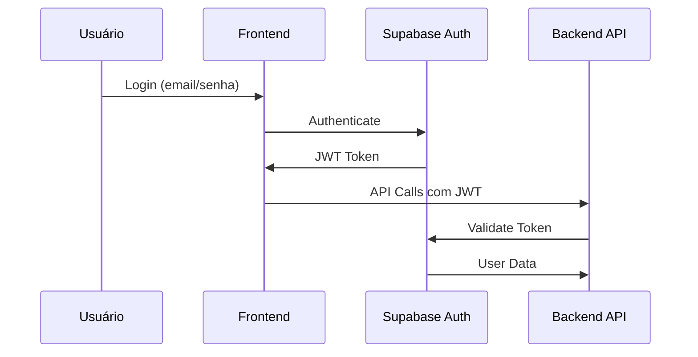
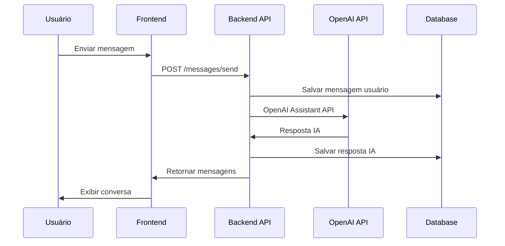
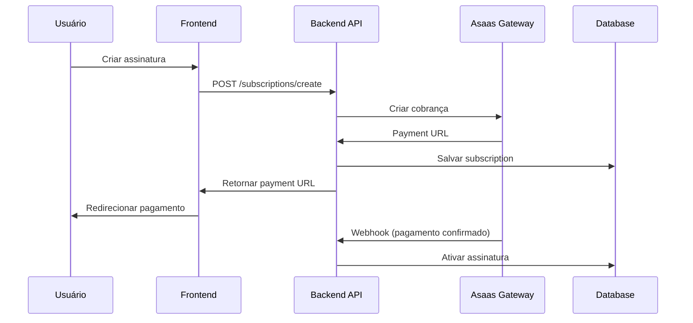

# Arquitetura do Sistema - NeuroIA Lab

## 🏗️ Visão Geral da Arquitetura

A NeuroIA Lab é uma plataforma SaaS moderna construída com arquitetura **JAMstack + API-first**, otimizada para escalabilidade e performance.

```
┌─────────────────┐    ┌─────────────────┐    ┌─────────────────┐
│    Frontend     │    │   Backend API   │    │   Supabase DB   │
│   React + TS    │◄──►│ Node.js + TS    │◄──►│  PostgreSQL +   │
│   Tailwind CSS  │    │   Express.js    │    │     Auth        │
└─────────────────┘    └─────────────────┘    └─────────────────┘
         │                       │                       │
         │                       │                       │
         ▼                       ▼                       ▼
┌─────────────────┐    ┌─────────────────┐    ┌─────────────────┐
│     Vercel      │    │   Vercel Edge   │    │   OpenAI API    │
│  (Hosting)      │    │   Functions     │    │  (Assistants)   │
└─────────────────┘    └─────────────────┘    └─────────────────┘
```

## 🔄 Fluxo de Dados Principal

### 1. Autenticação e Sessão


### 2. Interação com Assistentes


### 3. Sistema de Pagamentos


## 🏛️ Componentes da Arquitetura

### Frontend (React Application)

#### **Tecnologias Core**
- **React 18** com TypeScript
- **Vite** para build e dev server
- **Tailwind CSS** para styling
- **React Router** para roteamento

#### **Estrutura de Pastas**
```
frontend/
├── src/
│   ├── components/       # Componentes reutilizáveis
│   ├── pages/           # Páginas da aplicação
│   ├── hooks/           # Custom hooks
│   ├── services/        # API clients
│   ├── types/           # TypeScript types
│   ├── utils/           # Utilitários
│   └── styles/          # Estilos globais
├── public/              # Assets estáticos
└── dist/               # Build de produção
```

#### **Gerenciamento de Estado**
- **React Context** para estado global (autenticação)
- **useState/useEffect** para estado local
- **Custom hooks** para lógica reutilizável

#### **Comunicação com API**
- **Fetch API** nativo
- **Custom service layer** para endpoints
- **Error handling** centralizado
- **Request/Response interceptors**

### Backend (Node.js API)

#### **Tecnologias Core**
- **Node.js 18+** com TypeScript
- **Express.js** para API REST
- **JWT** para autenticação
- **Bcrypt** para hash de senhas

#### **Estrutura de Pastas**
```
backend/
├── src/
│   ├── controllers/     # Controllers da API
│   ├── middleware/      # Middleware personalizado
│   ├── routes/         # Definição de rotas
│   ├── services/       # Lógica de negócio
│   ├── types/          # TypeScript types
│   └── utils/          # Utilitários
├── dist/               # Build de produção
└── vercel.json         # Configuração Vercel
```

#### **Middleware Stack**
1. **CORS** - Cross-origin requests
2. **Body Parser** - Parse JSON/URL-encoded
3. **Rate Limiting** - Proteção contra abuse
4. **JWT Authentication** - Verificação de tokens
5. **Error Handler** - Tratamento de erros global

#### **Integração de Serviços**
- **Supabase Client** para database operations
- **OpenAI SDK** para assistentes de IA
- **Asaas SDK** para pagamentos
- **Nodemailer** para emails (futuro)

### Database (Supabase PostgreSQL)

#### **Esquema Principal**
```sql
-- Usuários (gerenciado pelo Supabase Auth)
auth.users
├── id (uuid, PK)
├── email (text, unique)
├── encrypted_password (text)
└── created_at (timestamp)

-- Assistentes de IA
public.assistants
├── id (text, PK)
├── name (text)
├── description (text)
├── area (text) -- Psicologia, Psicopedagogia, etc.
├── monthly_price (numeric)
├── semester_price (numeric)
├── is_active (boolean)
└── openai_assistant_id (text)

-- Conversas
public.conversations
├── id (uuid, PK)
├── user_id (uuid, FK)
├── assistant_id (text, FK)
├── title (text)
├── created_at (timestamp)
└── updated_at (timestamp)

-- Mensagens
public.messages
├── id (uuid, PK)
├── conversation_id (uuid, FK)
├── content (text)
├── role (text) -- 'user' | 'assistant'
└── created_at (timestamp)

-- Assinaturas
public.user_subscriptions
├── id (uuid, PK)
├── user_id (uuid, FK)
├── assistant_id (text, FK)
├── status (text) -- 'active' | 'expired' | 'cancelled'
├── start_date (timestamp)
├── end_date (timestamp)
└── asaas_subscription_id (text)
```

#### **Row Level Security (RLS)**
- **Usuários** só acessam seus próprios dados
- **Conversas** isoladas por user_id
- **Mensagens** acessíveis apenas pelo dono da conversa
- **Assinaturas** privadas por usuário

#### **Indices de Performance**
```sql
-- Índices principais
CREATE INDEX idx_conversations_user_id ON conversations(user_id);
CREATE INDEX idx_messages_conversation_id ON messages(conversation_id);
CREATE INDEX idx_subscriptions_user_id ON user_subscriptions(user_id);
CREATE INDEX idx_assistants_area_performance ON assistants(area, is_active);
```

### Integrações Externas

#### **OpenAI Assistants API**
- **Assistants** criados via OpenAI dashboard
- **Threads** gerenciados por conversa
- **Messages** síncronos via API
- **Run** execução e polling para respostas

#### **Asaas Payment Gateway**
- **Customers** criados automaticamente
- **Subscriptions** com cobrança recorrente
- **Webhooks** para status de pagamento
- **PIX/Boleto** métodos principais

#### **Supabase Auth**
- **JWT Tokens** para autenticação
- **Email confirmation** para novos usuários
- **Password reset** via email
- **Session management** automático

## 🚀 Deployment e Infraestrutura

### Hosting (Vercel)

#### **Frontend Deployment**
- **Build automático** via GitHub
- **CDN global** para assets estáticos
- **Edge caching** para performance
- **Custom domain** configurado

#### **API Deployment**
- **Serverless functions** na Vercel
- **Auto-scaling** baseado em demanda
- **Environment variables** seguras
- **Monitoring** integrado

### Configuração de Produção

#### **Environment Variables**
```bash
# Supabase
SUPABASE_URL=https://xxx.supabase.co
SUPABASE_ANON_KEY=eyJhbG...
SUPABASE_SERVICE_KEY=eyJhbG...

# OpenAI
OPENAI_API_KEY=sk-proj-xxx

# JWT
JWT_SECRET=supersecret

# Asaas
ASAAS_API_KEY=xxx
ASAAS_ENVIRONMENT=production
```

#### **Domínios e URLs**
- **Frontend**: https://neuroialab.com.br
- **API**: https://neuro-pro-backend-phi.vercel.app
- **Database**: https://xxx.supabase.co

## 📊 Performance e Monitoramento

### Métricas Principais

#### **Frontend Performance**
- **FCP (First Contentful Paint)**: < 1.5s
- **LCP (Largest Contentful Paint)**: < 2.5s
- **CLS (Cumulative Layout Shift)**: < 0.1
- **TTI (Time to Interactive)**: < 3s

#### **API Performance**
- **Response Time**: < 500ms (95th percentile)
- **Uptime**: > 99.9%
- **Error Rate**: < 0.1%
- **Throughput**: 1000+ req/min

#### **Database Performance**
- **Query Time**: < 100ms (average)
- **Connection Pool**: 20 connections
- **Cache Hit Rate**: > 90%
- **Storage**: Auto-scaling

### Monitoramento

#### **Error Tracking**
- **Frontend**: Console errors + user feedback
- **Backend**: Express error middleware
- **Database**: Supabase dashboard metrics

#### **Analytics**
- **User behavior**: Custom events
- **Conversion tracking**: Payment funnel
- **Usage patterns**: Assistant popularity

## 🔒 Segurança

### Autenticação e Autorização
- **JWT Tokens** com expiração
- **Row Level Security** no database
- **Rate limiting** por usuário
- **Input validation** em todas as APIs

### Proteção de Dados
- **HTTPS** obrigatório
- **Environment variables** para secrets
- **Database encryption** at rest
- **CORS** configurado adequadamente

### Compliance
- **LGPD** compliance para dados brasileiros
- **Data minimization** - apenas dados necessários
- **Right to deletion** implementado
- **Audit logs** para operações admin

## 🔄 Escalabilidade

### Arquitetura Stateless
- **API functions** sem estado local
- **JWT tokens** para sessão
- **Database** como única fonte de verdade
- **Cache** em múltiplas camadas

### Auto-scaling
- **Vercel functions** escalam automaticamente
- **Supabase** handled pela infraestrutura
- **OpenAI API** com rate limits adequados
- **CDN** para assets estáticos

### Otimizações Futuras
- **Redis cache** para session/data caching
- **Database read replicas** para queries
- **Message queues** para operações assíncronas
- **Microservices** para funcionalidades específicas

---

**📊 Última atualização**: Janeiro 2025 | **🏗️ Versão Arquitetura**: 3.1.0