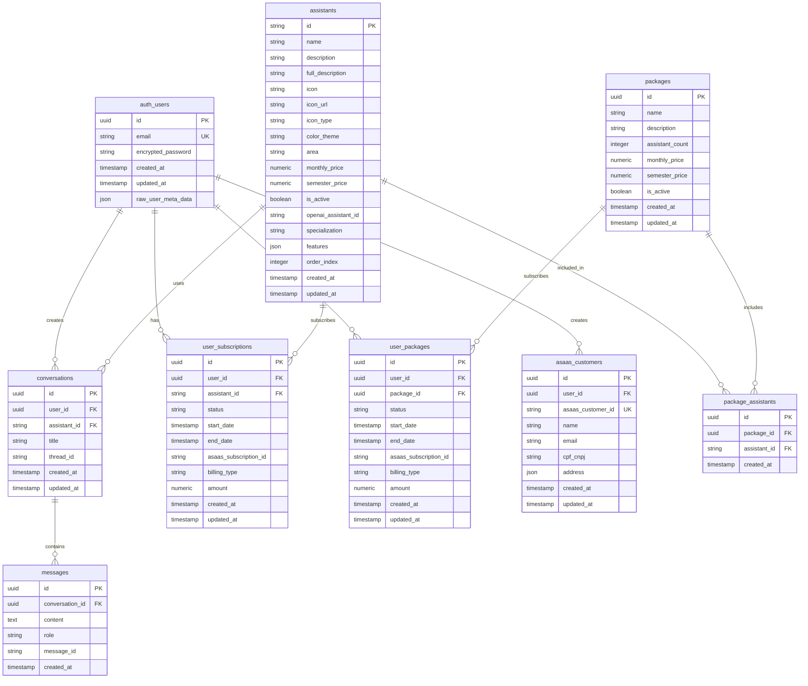

# Schema do Banco de Dados - NeuroIA Lab

## 🗃️ Visão Geral

O NeuroIA Lab utiliza **PostgreSQL via Supabase** com **Row Level Security (RLS)** para isolamento de dados e segurança avançada.

## 📊 Diagrama de Entidades



## 📋 Detalhamento das Tabelas

### 1. auth.users (Supabase Auth)
**Gerenciada automaticamente pelo Supabase Auth**

| Campo | Tipo | Restrições | Descrição |
|-------|------|------------|-----------|
| `id` | uuid | PK, NOT NULL | Identificador único do usuário |
| `email` | text | UNIQUE, NOT NULL | Email do usuário |
| `encrypted_password` | text | NOT NULL | Senha criptografada |
| `created_at` | timestamptz | NOT NULL | Data de criação |
| `updated_at` | timestamptz | NOT NULL | Última atualização |
| `raw_user_meta_data` | json | | Dados adicionais do usuário |

### 2. public.assistants
**Catálogo de assistentes de IA disponíveis**

| Campo | Tipo | Restrições | Descrição |
|-------|------|------------|-----------|
| `id` | varchar(50) | PK, NOT NULL | ID único do assistente |
| `name` | varchar(100) | NOT NULL | Nome do assistente |
| `description` | text | NOT NULL | Descrição curta |
| `full_description` | text | | Descrição completa |
| `icon` | varchar(10) | NOT NULL | Emoji ou código do ícone |
| `icon_url` | text | | URL do ícone personalizado |
| `icon_type` | varchar(10) | CHECK(svg, image, emoji) | Tipo do ícone |
| `color_theme` | varchar(20) | NOT NULL | Tema de cores |
| `area` | varchar(30) | NOT NULL, CHECK | Área de especialização |
| `monthly_price` | numeric(10,2) | NOT NULL | Preço mensal |
| `semester_price` | numeric(10,2) | NOT NULL | Preço semestral |
| `is_active` | boolean | NOT NULL, DEFAULT true | Se está ativo |
| `openai_assistant_id` | text | | ID do assistente na OpenAI |
| `specialization` | text | | Especialização específica |
| `features` | text[] | DEFAULT '{}' | Lista de recursos |
| `order_index` | integer | DEFAULT 0 | Ordem de exibição |
| `created_at` | timestamptz | NOT NULL, DEFAULT now() | Data de criação |
| `updated_at` | timestamptz | NOT NULL, DEFAULT now() | Última atualização |

#### **Constraint de Área**
```sql
CHECK (area IN ('Psicologia', 'Psicopedagogia', 'Fonoaudiologia', 'Neuromodulação', 'Terapia Ocupacional'))
```

### 3. public.conversations
**Conversas entre usuários e assistentes**

| Campo | Tipo | Restrições | Descrição |
|-------|------|------------|-----------|
| `id` | uuid | PK, NOT NULL, DEFAULT gen_random_uuid() | ID da conversa |
| `user_id` | uuid | FK, NOT NULL | Referência ao usuário |
| `assistant_id` | varchar(50) | FK, NOT NULL | Referência ao assistente |
| `title` | varchar(200) | NOT NULL | Título da conversa |
| `thread_id` | text | | ID do thread na OpenAI |
| `created_at` | timestamptz | NOT NULL, DEFAULT now() | Data de criação |
| `updated_at` | timestamptz | NOT NULL, DEFAULT now() | Última atualização |

#### **Foreign Keys**
```sql
FOREIGN KEY (user_id) REFERENCES auth.users(id) ON DELETE CASCADE
FOREIGN KEY (assistant_id) REFERENCES assistants(id) ON DELETE RESTRICT
```

### 4. public.messages
**Mensagens individuais das conversas**

| Campo | Tipo | Restrições | Descrição |
|-------|------|------------|-----------|
| `id` | uuid | PK, NOT NULL, DEFAULT gen_random_uuid() | ID da mensagem |
| `conversation_id` | uuid | FK, NOT NULL | Referência à conversa |
| `content` | text | NOT NULL | Conteúdo da mensagem |
| `role` | varchar(20) | NOT NULL, CHECK | Papel (user/assistant) |
| `message_id` | text | | ID da mensagem na OpenAI |
| `created_at` | timestamptz | NOT NULL, DEFAULT now() | Data de criação |

#### **Constraints**
```sql
CHECK (role IN ('user', 'assistant'))
FOREIGN KEY (conversation_id) REFERENCES conversations(id) ON DELETE CASCADE
```

### 5. public.user_subscriptions
**Assinaturas individuais de assistentes**

| Campo | Tipo | Restrições | Descrição |
|-------|------|------------|-----------|
| `id` | uuid | PK, NOT NULL, DEFAULT gen_random_uuid() | ID da assinatura |
| `user_id` | uuid | FK, NOT NULL | Referência ao usuário |
| `assistant_id` | varchar(50) | FK, NOT NULL | Referência ao assistente |
| `status` | varchar(20) | NOT NULL, CHECK | Status da assinatura |
| `start_date` | timestamptz | NOT NULL | Data de início |
| `end_date` | timestamptz | NOT NULL | Data de término |
| `asaas_subscription_id` | text | | ID na Asaas |
| `billing_type` | varchar(20) | NOT NULL, CHECK | Tipo de cobrança |
| `amount` | numeric(10,2) | NOT NULL | Valor da assinatura |
| `created_at` | timestamptz | NOT NULL, DEFAULT now() | Data de criação |
| `updated_at` | timestamptz | NOT NULL, DEFAULT now() | Última atualização |

#### **Constraints**
```sql
CHECK (status IN ('active', 'expired', 'cancelled', 'pending'))
CHECK (billing_type IN ('MONTHLY', 'SEMESTER'))
UNIQUE (user_id, assistant_id, status) WHERE status = 'active'
```

### 6. public.packages
**Pacotes de múltiplos assistentes**

| Campo | Tipo | Restrições | Descrição |
|-------|------|------------|-----------|
| `id` | uuid | PK, NOT NULL, DEFAULT gen_random_uuid() | ID do pacote |
| `name` | varchar(100) | NOT NULL | Nome do pacote |
| `description` | text | | Descrição do pacote |
| `assistant_count` | integer | NOT NULL | Número de assistentes |
| `monthly_price` | numeric(10,2) | NOT NULL | Preço mensal |
| `semester_price` | numeric(10,2) | NOT NULL | Preço semestral |
| `is_active` | boolean | NOT NULL, DEFAULT true | Se está ativo |
| `created_at` | timestamptz | NOT NULL, DEFAULT now() | Data de criação |
| `updated_at` | timestamptz | NOT NULL, DEFAULT now() | Última atualização |

### 7. public.user_packages
**Assinaturas de pacotes por usuários**

| Campo | Tipo | Restrições | Descrição |
|-------|------|------------|-----------|
| `id` | uuid | PK, NOT NULL, DEFAULT gen_random_uuid() | ID da assinatura |
| `user_id` | uuid | FK, NOT NULL | Referência ao usuário |
| `package_id` | uuid | FK, NOT NULL | Referência ao pacote |
| `status` | varchar(20) | NOT NULL, CHECK | Status da assinatura |
| `start_date` | timestamptz | NOT NULL | Data de início |
| `end_date` | timestamptz | NOT NULL | Data de término |
| `asaas_subscription_id` | text | | ID na Asaas |
| `billing_type` | varchar(20) | NOT NULL, CHECK | Tipo de cobrança |
| `amount` | numeric(10,2) | NOT NULL | Valor da assinatura |
| `created_at` | timestamptz | NOT NULL, DEFAULT now() | Data de criação |
| `updated_at` | timestamptz | NOT NULL, DEFAULT now() | Última atualização |

### 8. public.package_assistants
**Relacionamento entre pacotes e assistentes**

| Campo | Tipo | Restrições | Descrição |
|-------|------|------------|-----------|
| `id` | uuid | PK, NOT NULL, DEFAULT gen_random_uuid() | ID do relacionamento |
| `package_id` | uuid | FK, NOT NULL | Referência ao pacote |
| `assistant_id` | varchar(50) | FK, NOT NULL | Referência ao assistente |
| `created_at` | timestamptz | NOT NULL, DEFAULT now() | Data de criação |

#### **Constraints**
```sql
UNIQUE (package_id, assistant_id)
```

### 9. public.asaas_customers
**Clientes sincronizados com Asaas**

| Campo | Tipo | Restrições | Descrição |
|-------|------|------------|-----------|
| `id` | uuid | PK, NOT NULL, DEFAULT gen_random_uuid() | ID interno |
| `user_id` | uuid | FK, NOT NULL | Referência ao usuário |
| `asaas_customer_id` | text | UNIQUE, NOT NULL | ID do cliente na Asaas |
| `name` | varchar(100) | NOT NULL | Nome do cliente |
| `email` | varchar(100) | NOT NULL | Email do cliente |
| `cpf_cnpj` | varchar(20) | | CPF ou CNPJ |
| `address` | json | | Dados de endereço |
| `created_at` | timestamptz | NOT NULL, DEFAULT now() | Data de criação |
| `updated_at` | timestamptz | NOT NULL, DEFAULT now() | Última atualização |

## 🔒 Row Level Security (RLS)

### Políticas de Segurança

#### **conversations**
```sql
-- Usuários só veem suas próprias conversas
CREATE POLICY "Users can view own conversations" ON conversations
    FOR ALL USING (auth.uid() = user_id);
```

#### **messages**
```sql
-- Usuários só veem mensagens de suas conversas
CREATE POLICY "Users can view own messages" ON messages
    FOR ALL USING (
        conversation_id IN (
            SELECT id FROM conversations WHERE user_id = auth.uid()
        )
    );
```

#### **user_subscriptions**
```sql
-- Usuários só veem suas próprias assinaturas
CREATE POLICY "Users can view own subscriptions" ON user_subscriptions
    FOR ALL USING (auth.uid() = user_id);
```

#### **assistants**
```sql
-- Todos podem visualizar assistentes ativos
CREATE POLICY "Anyone can view active assistants" ON assistants
    FOR SELECT USING (is_active = true);
```

## 📈 Índices de Performance

### Índices Principais
```sql
-- Conversas por usuário
CREATE INDEX idx_conversations_user_id ON conversations(user_id);
CREATE INDEX idx_conversations_updated_at ON conversations(updated_at DESC);

-- Mensagens por conversa
CREATE INDEX idx_messages_conversation_id ON messages(conversation_id);
CREATE INDEX idx_messages_created_at ON messages(created_at DESC);

-- Assinaturas por usuário
CREATE INDEX idx_subscriptions_user_id ON user_subscriptions(user_id);
CREATE INDEX idx_subscriptions_status ON user_subscriptions(status);

-- Assistentes por área e status
CREATE INDEX idx_assistants_area_performance ON assistants(area, is_active);
CREATE INDEX idx_assistants_active ON assistants(is_active) WHERE is_active = true;

-- Busca de text em assistentes
CREATE INDEX idx_assistants_search ON assistants USING gin(to_tsvector('portuguese', name || ' ' || description));
```

### Índices Compostos
```sql
-- Assinatura ativa por usuário e assistente
CREATE INDEX idx_subscription_user_assistant_active
ON user_subscriptions(user_id, assistant_id, status)
WHERE status = 'active';

-- Conversas recentes por usuário
CREATE INDEX idx_conversations_user_recent
ON conversations(user_id, updated_at DESC);
```

## 🔄 Triggers e Funções

### Atualização Automática de Timestamps
```sql
CREATE OR REPLACE FUNCTION update_updated_at_column()
RETURNS TRIGGER AS $$
BEGIN
    NEW.updated_at = now();
    RETURN NEW;
END;
$$ language 'plpgsql';

-- Aplicar a tabelas relevantes
CREATE TRIGGER update_assistants_updated_at
    BEFORE UPDATE ON assistants
    FOR EACH ROW EXECUTE FUNCTION update_updated_at_column();

CREATE TRIGGER update_conversations_updated_at
    BEFORE UPDATE ON conversations
    FOR EACH ROW EXECUTE FUNCTION update_updated_at_column();
```

### Validações de Negócio
```sql
-- Função para validar datas de assinatura
CREATE OR REPLACE FUNCTION validate_subscription_dates()
RETURNS TRIGGER AS $$
BEGIN
    IF NEW.end_date <= NEW.start_date THEN
        RAISE EXCEPTION 'End date must be after start date';
    END IF;
    RETURN NEW;
END;
$$ language 'plpgsql';

CREATE TRIGGER validate_subscription_dates_trigger
    BEFORE INSERT OR UPDATE ON user_subscriptions
    FOR EACH ROW EXECUTE FUNCTION validate_subscription_dates();
```

## 📊 Views Úteis

### Assinaturas Ativas com Detalhes
```sql
CREATE VIEW active_subscriptions_detailed AS
SELECT
    us.id,
    us.user_id,
    u.email as user_email,
    a.name as assistant_name,
    a.area as assistant_area,
    us.status,
    us.start_date,
    us.end_date,
    us.amount,
    us.billing_type
FROM user_subscriptions us
JOIN auth.users u ON us.user_id = u.id
JOIN assistants a ON us.assistant_id = a.id
WHERE us.status = 'active';
```

### Estatísticas de Uso por Área
```sql
CREATE VIEW area_usage_stats AS
SELECT
    a.area,
    COUNT(DISTINCT us.user_id) as active_users,
    COUNT(us.id) as total_subscriptions,
    SUM(us.amount) as total_revenue
FROM assistants a
LEFT JOIN user_subscriptions us ON a.id = us.assistant_id AND us.status = 'active'
GROUP BY a.area;
```

## 🚀 Migrações

### Sistema de Versionamento
As migrações seguem o padrão:
```
YYYYMMDDHHMMSS_migration_name.sql
```

Exemplo: `20250118140000_add_new_areas.sql`

### Aplicação de Migrações
```sql
-- Tabela de controle de migrações
CREATE TABLE IF NOT EXISTS schema_migrations (
    version VARCHAR(255) PRIMARY KEY,
    applied_at TIMESTAMP WITH TIME ZONE DEFAULT NOW()
);
```

---

**📊 Última atualização**: Janeiro 2025 | **🗄️ Versão Schema**: 3.1.0